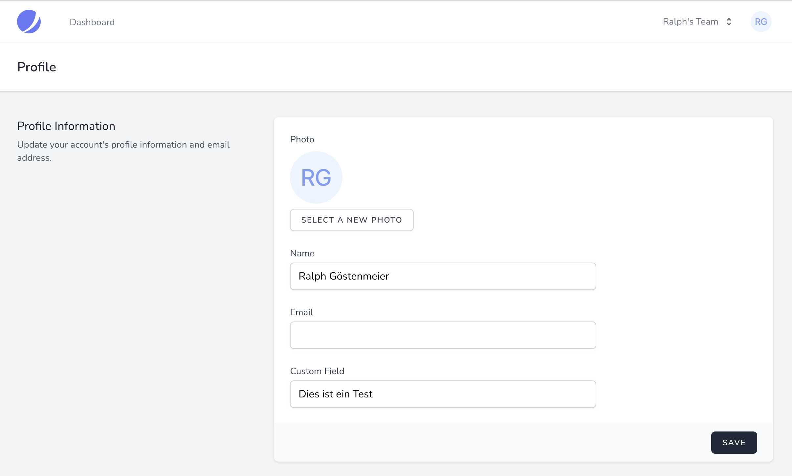

#

## Install NodeJS

## Install PHP, Laravel und Composer

## Erstellen derBasis-Anwendung

```shell
laravel new App --jet --teams --stack livewire
```

```shell
composer require spatie/laravel-newsletter 
```

```shell
php artisan vendor:publish --provider="Spatie\Newsletter\NewsletterServiceProvider"
```

## Laravel Datenbank konfogirueren

```config
DB_CONNETION=sqlite
```

```shell
touch database/database.sqlite
php artisan migrate
```

## Laravel konfigurieren

```app/config/fortify.php```

```php
'features' => [
    Features::emailVerification(), 
```

```app/config/jetstream.php```

```php
'features' => [
    Features::termsAndPrivacyPolicy(),
    Features::profilePhotos(),
```

```app/Models/User.php```

```php
class User extends Authenticatable implements MustVerifyEmail
```

## Auto-Login nach Registrierung deaktivieren

### Modifizieren des Fortify REgistertUserController

```vendor/laravel/fortify/src/Http/Controllers/RegisteredUserController.php```

Deaktvieren durch auskommentieren der Zeile ```$this->guard->login($user);```

```php
    public function store(Request $request,
                          CreatesNewUsers $creator): RegisterResponse
    {
        event(new Registered($user = $creator->create($request->all())));

        // $this->guard->login($user);

        return app(RegisterResponse::class);
    }
```

### Hinzufügen einer eigenen RegisterResponse

#### Erstellen einer neuen Klasse

```app/Http/Responses/RegisterResponse.php```

```php
<?php

namespace App\Http\Responses;

use Illuminate\Contracts\Auth\StatefulGuard;
use Laravel\Fortify\Http\Responses\RegisterResponse as FortifyRegisterResponse;

class RegisterResponse extends FortifyRegisterResponse
{
    protected $guard;

    public function __construct(StatefulGuard $guard)
    {
        $this->guard = $guard;
    }

    public function toResponse($request)
    {
        $this->guard->logout();

        return parent::toResponse($request);
    }
}
```

#### Registrieren der neuen Klasse

```app/Providers/JetstreamServiceProvider.php```

```php

...

    public function boot()
    {
        $this->configurePermissions();

        ...

        // register new LoginResponse
        $this->app->singleton(
            \Laravel\Fortify\Contracts\RegisterResponse::class,
            \App\Http\Responses\RegisterResponse::class
        );
    }
```

## Benutzermodel um ein Feld erweitern

### Migration für das neue Feld erstellen

```shell
php artisan make:migration add_column_customfield_to_users_table --table users
```

Bearbeiten der Datei ```database/migrations/2022_02_08_190657_add_column_customfield_to_users_table.php```

```php
return new class extends Migration
{
    public function up()
    {
        Schema::table('users', function (Blueprint $table) {
            $table->string('customfield')->nullable();
        });
    }

    public function down()
    {
        Schema::table('users', function (Blueprint $table) {
            $table->dropColumn('customfield');
        });
    }
};
```

### Benutzermodell erweitern

Bearbeiten der Datei ```app/Models/User.php```

```php
    protected $fillable = [
        'name', 'email', 'password', 'customfield'
    ];
```

### Migration durchführen

```shell
$ php artisan migrate
Migrating: 2022_02_08_190657_add_column_customfield_to_users_table
Migrated:  2022_02_08_190657_add_column_customfield_to_users_table (1.18ms)
```

### Controller UpdateUserProfileInformation erweitern

Bearbeiten der Datei ```app/Actions/Fortify/UpdateUserProfileInformation.php```

```php
    public function update($user, array $input)
    {
        Validator::make($input, [
            'name' => ['required', 'string', 'max:255'],
            'email' => ['required', 'email', 'max:255', Rule::unique('users')->ignore($user->id)],
            'photo' => ['nullable', 'mimes:jpg,jpeg,png', 'max:1024'],
```

```php
            'customfield' => ['nullable', 'string', 'max:255'],    // <-- ADD THIS
```

```php
        ])->validateWithBag('updateProfileInformation');

        if (isset($input['photo'])) {
            $user->updateProfilePhoto($input['photo']);
        }

        if ($input['email'] !== $user->email &&
            $user instanceof MustVerifyEmail) {
            $this->updateVerifiedUser($user, $input);
        } else {
            $user->forceFill([
                'name' => $input['name'],
                'email' => $input['email'],
```

```php
                'customfield' => $input['customfield'],   // <-- ADD THIS
```

```php
            ])->save();
        }
    }
```

### View update-profile-information-form erweitern

Bearbeiten der Datei ```resources/views/profile/update-profile-information-form.blade.php```

Hinzufügen eines neuen Abschnittes nach dem Abschnitt <!-- EMail -->

```php
        <!-- Custom Field -->
            <div class="col-span-6 sm:col-span-4">
            <x-jet-label for="customfield" value="{{ __('Custom Field') }}" />
            <x-jet-input id="customfield" type="text" class="mt-1 block w-full" wire:model.defer="state.customfield" />
            <x-jet-input-error for="customfield" class="mt-2" />
        </div>
```

